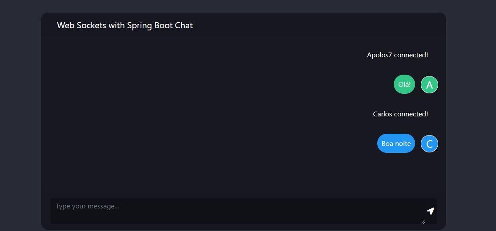

# Chat WebSocket com Spring




> Um chat simples desenvolvido utilizando o procotolo WebSocket no Spring Boot.

## 💻 Pré-requisitos

Antes de começar, verifique se você atendeu aos seguintes requisitos:

* É necessário ter pelo menos o `Java JDK 8`
* Dica de leitura: [Via de mão dupla com WebSockets](https://www.devmedia.com.br/via-de-mao-dupla-com-websockets/28281).

## ☕ Instalando e usando websocket-spring-chat

Para instalar o websocket-spring-chat, siga estas etapas:

Linux, MacOS e Windows:
```
git clone git@github.com:Apolos7/websocket-spring-chat.git
```

Para usar websocket-spring-chat, siga estas etapas:

```
cd websocket-spring-chat/
mvn spring-boot:start
```
Com isso você pode acessar a pagina do chat no endereço [http://localhost:8080](http://localhost:8080)
